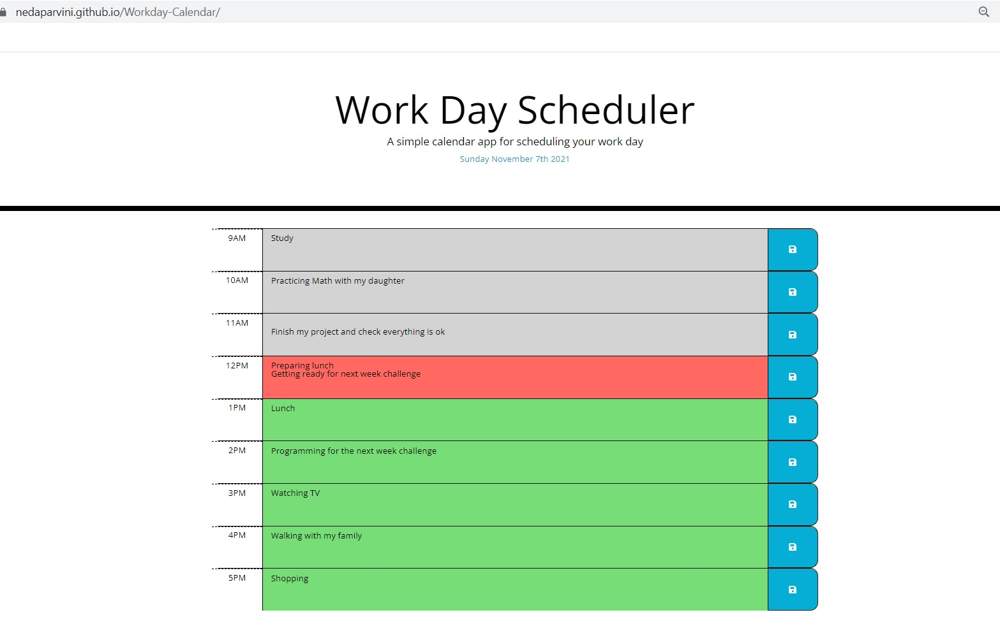

Links:

https://github.com/NedaParvini/Workday-Calendar
https://nedaparvini.github.io/Workday-Calendar/

How to Code:

First, I created a repository and then clone it to my device.
Then I wrote codes in html for different time blocks and defined them as separated 
s 
I gave them some Bootstrap styles.
I also defined <script> so I assigned js external file
In JS file first I defined saveBtn as a variable and then I wrote a code to show current day in top of the page
Then I wrote function for each block to show when we are in the past, present or future and change the background color based on different color codes.
If statement checks the "current hour". If it is larger than the hour we are in, it considers as a future and turn to green. If the "current hour" equals to the hour it considers this as a present time and the other option considers as a past.
Each time I write a task in the planner and I push the save button it goes to local storage and save there, so when I refresh the page, I can see them.
I call the functions at the end of the file.

Screenshot:

